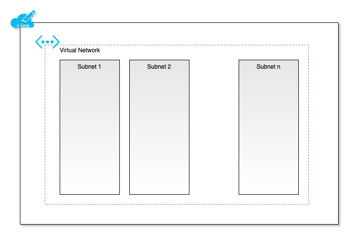

# terraform-azure-vnet
[Terraform](https://www.terraform.io) module for [Azure VNet](https://azure.microsoft.com/en-gb/services/virtual-network/).

This creates an Azure virtual network and a number of subnets, as specified by the provided variables. Examine [variables.tf](variables.tf) to understand the variable structure; [variables.tfvars](variables.tfvars) for example values.



## Install
This module requires that the following are installed locally:
* [Docker](https://www.docker.com/get-started)
* [Terraform](https://learn.hashicorp.com/tutorials/terraform/install-cli)

It also requires that there is an existing [Azure Resource Group](https://docs.microsoft.com/en-us/azure/azure-resource-manager/management/manage-resource-groups-portal) into which to place the VNet components.

## Usage

### Log Into Azure
```bash
docker run -it -v $HOME/.azure:/root/.azure mcr.microsoft.com/azure-cli az login
```

### Create the Virtual Network
```bash
# set the values below to reflect the resource group and remote storage
export TF_VAR_resource_group_name=
export TF_VAR_storage_account_name=
export TF_VAR_container_name=

# initialise terraform 
terraform init \
  -backend-config "resource_group_name=$TF_VAR_resource_group_name" \
  -backend-config "storage_account_name=$TF_VAR_storage_account_name" \
  -backend-config "container_name=$TF_VAR_container_name"

# create a terraform plan file from the provided variables
# NOTE: the existing Azure resource group will need to be provided at the command-line, or manually added to the tfvars file 
terraform plan -var-file="variables.tfvars" -out tfplan

# apply the plan, creating the Azure VNet resources
terraform apply "tfplan"
```

### Destroy the Virtual Network
```bash
terraform destroy -var-file="variables.tfvars"
```

## Licence
[](https://opensource.org/licenses/Apache-2.0)

This project is licenced under the terms of the [Apache 2.0 License](LICENCE.md) licence.